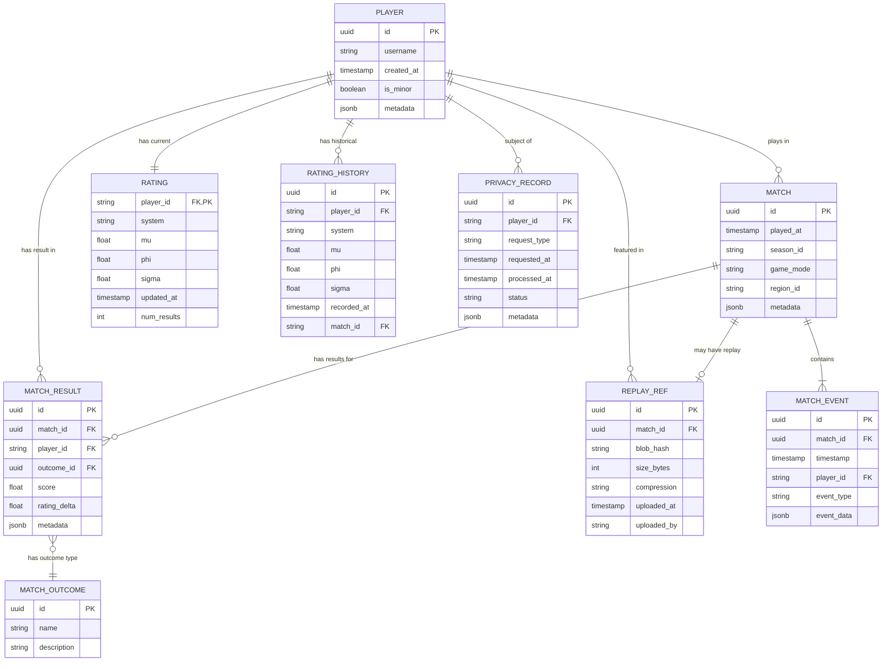

# Data Model Relationships

## Overview

This diagram shows the core data model relationships in the indie_match_history engine.

## Entity Relationship Diagram



## Key Constraints

### Immutability

- **MATCH**: Immutable once created (no updates allowed)
- **MATCH_EVENT**: Immutable (append-only)
- **MATCH_RESULT**: Immutable (corrections via new entries)

### Uniqueness

- **PLAYER.id**: Globally unique UUID
- **MATCH.id**: Globally unique UUID
- **RATING.player_id + system**: Unique per rating system
- **REPLAY_REF.blob_hash**: Content-addressed (SHA-256)

### Foreign Keys

- MATCH_EVENT.match_id → MATCH.id (cascade delete)
- MATCH_RESULT.match_id → MATCH.id (cascade delete)
- MATCH_RESULT.player_id → PLAYER.id (restrict delete)
- RATING.player_id → PLAYER.id (cascade delete)
- REPLAY_REF.match_id → MATCH.id (set null on delete)

## Indexes

### Primary Indexes

| Table | Index | Type |
|-------|-------|------|
| PLAYER | id (PK) | Unique |
| MATCH | id (PK) | Unique |
| MATCH | played_at | Non-unique |
| MATCH | season_id, played_at | Composite |
| RATING | player_id + system | Composite unique |
| REPLAY_REF | blob_hash | Unique |

### Secondary Indexes

| Table | Index | Purpose |
|-------|-------|---------|
| MATCH_RESULT | player_id | Player history lookup |
| MATCH_RESULT | match_id | Match results lookup |
| MATCH_EVENT | match_id | Event timeline |
| RATING_HISTORY | player_id, recorded_at | Rating history |

## Schema Versions

### v1 (Initial)
- Core tables: PLAYER, MATCH, MATCH_RESULT, MATCH_EVENT, RATING
- Basic relationships

### v2 (Replay Support)
- Added: REPLAY_REF
- Added: MATCH.replay_id (optional FK)
- Added: Content addressing (SHA-256)

### v3 (Privacy)
- Added: PRIVACY_RECORD
- Added: PLAYER.is_minor
- Added: Retention metadata to MATCH
- Added: GDPR/COPPA tracking

## Storage Mapping

The data model maps to storage backends:

| Table | SQLite Table | In-Memory |
|-------|--------------|-----------|
| PLAYER | players | Dict[player_id, Player] |
| MATCH | matches | Dict[match_id, Match] |
| MATCH_RESULT | match_results | Nested in Match |
| MATCH_EVENT | match_events | Nested in Match |
| RATING | ratings | Dict[player_id, Rating] |
| REPLAY_REF | N/A (file system) | N/A |

## Migration Path

When upgrading schema versions:

```python
from indie_match_history.schema import migrate

# Migrate to v2 (replay support)
migrate(storage, to_version=2)

# Migrate to v3 (privacy)
migrate(storage, to_version=3)
```

Migrations are:
- **Forward-only**: Cannot downgrade
- **Idempotent**: Safe to re-run
- **Tested**: Covered by pytest suite

See `indie_match_history/schema.py` for implementation.

## Usage Examples

### Creating a Match

```python
from indie_match_history import MatchHistoryEngine

engine = MatchHistoryEngine()

# Register players
engine.register_player("player-1", username="Alice")
engine.register_player("player-2", username="Bob")

# Record a match
match_id = engine.register_match(
    players=["player-1", "player-2"],
    results=[
        {"player_id": "player-1", "score": 1.0},
        {"player_id": "player-2", "score": 0.0},
    ],
    metadata={"mode": "deathmatch"},
)
```

### Querying Player History

```python
# Get player match history
matches = engine.list_matches(
    player_id="player-1",
    limit=10,
    order_by="played_at DESC",
)

# Get rating history
rating_history = engine.get_player_rating_history(
    player_id="player-1",
    from_date=datetime(2025, 1, 1),
)
```

### Leaderboard

```python
# Get top 100 players
leaderboard = engine.get_leaderboard(top_n=100)

# Each entry: {player_id, rating, rank}
```

## Design Principles

1. **Immutability**: Historical data never changes
2. **Append-only**: New data only, no updates
3. **Content-addressed**: Replays identified by hash, not ID
4. **Typed**: All records use typed dataclasses
5. **Validated**: All inputs validated before storage

## Future Extensions

Potential additions (not yet implemented):

- **TEAM**: For team-based matches
- **TOURNAMENT**: For tournament structures
- **SEASON**: For seasonal rankings (currently just metadata)
- **ACHIEVEMENT**: For player achievements
- **STATS**: For aggregate statistics
