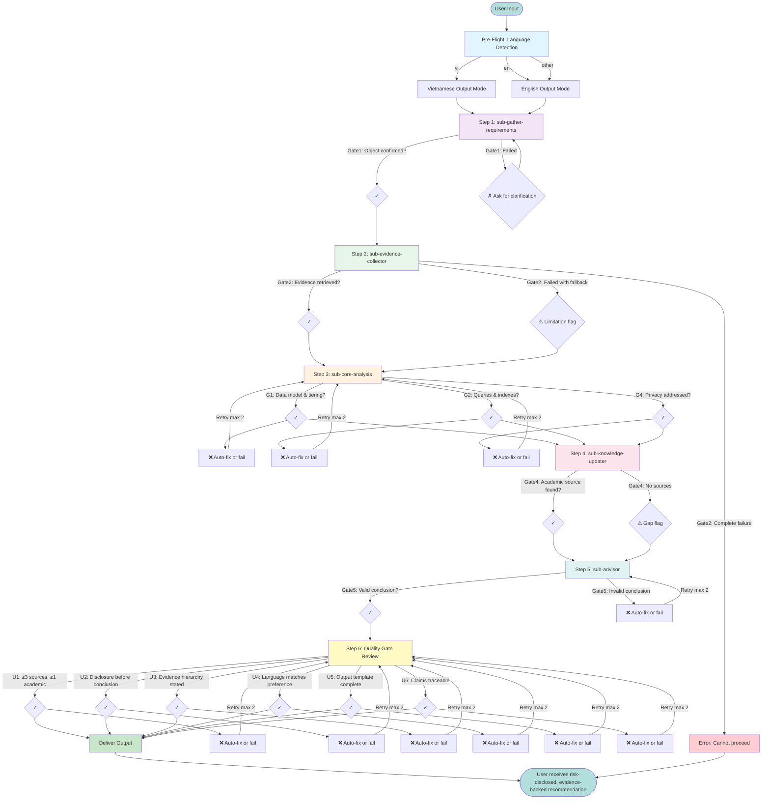

# Harness Execution Flow

## Overview

This diagram shows the end-to-end execution flow of the indie-game-match-history-database harness, from user input through quality gates to final output.

## Flow Diagram



## Quality Gates

### Universal Gates (U1-U6)

| Gate | Criterion | Auto-Fix |
|------|-----------|----------|
| U1 | ≥3 sources, ≥1 academic/authoritative | Search knowledge base |
| U2 | Disclosure before conclusion | Prepend disclosure section |
| U3 | Evidence hierarchy stated | Add tier labels to sources |
| U4 | Language matches preference | Translate output |
| U5 | Output template complete | Fill missing sections |
| U6 | Claims traceable | Add source references |

### Domain Gates (G1-G4)

| Gate | Criterion | Engine Module |
|------|-----------|---------------|
| G1 | Data model & tiering defined | `models.py`, `storage/tiered.py` |
| G2 | Queries & indexes designed | `storage/base.py` |
| G3 | Scalability addressed | `storage/sqlite.py` |
| G4 | Privacy/retention addressed | `privacy.py` |

## Error Recovery

| Error Type | Action | Retry Limit |
|------------|--------|-------------|
| No object of analysis | Ask for clarification | 3 |
| Evidence fetch failed | Fallback to knowledge base | 2 |
| Quality gate failed | Auto-fix or manual | 2 |
| Language mismatch | Translate | 1 |

## Graceful Degradation

The harness operates at 5 degradation levels:

| Level | Capability | Limitation Flag |
|-------|------------|-----------------|
| 0 | Full operation | None |
| 1 | Real-time data unavailable | Using cached sources |
| 2 | Knowledge base unavailable | Expert judgment only |
| 3 | Sub-skill unavailable | Manual analysis |
| 4 | Harness failed | Cannot complete |

## Parallel Execution

When `enable_parallel_subskills = true`:

```
Step 1 → Step 2 (parallel starts) → Step 3 (parallel starts) → Step 4 (parallel starts) → Step 5
              ↓                        ↓                         ↓
         Evidence              Core Analysis           Knowledge Update
```

Max concurrent subskills: 3 (configurable via `max_concurrent_subskills`).

## Engine Grounding

Each step grounds its analysis in the tested engine:

- **Step 3**: References `indie_match_history/models.py` for data model
- **Step 3**: References `indie_match_history/storage/` for tiering
- **Step 3**: References `indie_match_history/privacy.py` for GDPR/COPPA
- **Step 3**: References `indie_match_history/ratings.py` for rating systems

This ensures recommendations are not theoretical but validated by code.
